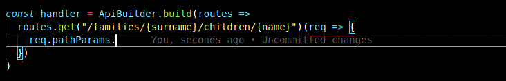

# TS Lambda Router.

Router for AWS Lambdas/API Gateway proxy integration

Uses Typescript template types to provider strongly typed goodness for your API Handlers

### Demo



### Usage:

```typescript
import { Type } from "@sinclair/typebox";

export const Account = Type.Object({
  username: Type.String(),
  password: Type.String(),
  firstname: Type.String(),
  lastname: Type.String(),
  birthYear: Type.Integer(),
});

export const handler: APIGatewayProxyHandler =
    ApiBuilder.build((routes) =>
        routes
          .get("/accounts/${username}")((r) =>
            Domain
              .getAccount(r.pathParams.username)
              .then((a) => ({
                statusCode: a ? 200 : 404,
                body: JSON.stringify(a),
              })
            )
          )
          .post("/accounts", Account)(r =>
            Domain
              .saveAccount(r.body)
              .then(() => ({
                statusCode: 201,
                body: "",
              })
            )
        )

```

See full example at [./src/example](./src/example)